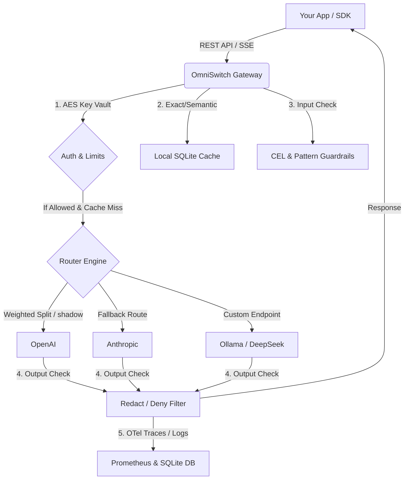

# <p align="center"><br/>OmniSwitch</p>

<p align="center">
  <strong>The Open-Source, Zero-Dependency AI Gateway & Guardrail Layer for Production Teams</strong>
</p>

<p align="center">
  <a href="https://github.com/omniswitch-dev/omniswitch/actions"></a>
  <a href="https://golang.org"></a>
  <a href="https://github.com/omniswitch-dev/omniswitch/blob/main/LICENSE"></a>
  <a href="https://omniswitch.dev"></a>
</p>

---

OmniSwitch is a high-performance, single-binary AI gateway designed to route, secure, cache, and observe all your LLM traffic across 1,600+ models. 

Unlike SaaS-only alternatives or heavy microservice proxies, OmniSwitch runs completely locally with **zero external dependencies** (no Redis, Postgres, or external vector DB required), utilizing an embedded high-concurrency **SQLite** engine for key management, semantic vector caching, policy auditing, and request logging.

## 🚀 Key Capabilities

*   **Unified OpenAI-Compatible API:** Single endpoint to query OpenAI, Anthropic, Gemini, Groq, or any local custom deployment (Ollama, vLLM, DeepSeek, Together AI).
*   **Zero-Overhead Semantic Caching:** Local SQLite-backed exact-match and semantic similarity vector caching to slash token bills and latency.
*   **Sub-Millisecond Guardrails:** Local input/output guardrails executing CEL (Common Expression Language) and regex to block prompt injection, toxic content, SQL injection, and PII leaks.
*   **Virtual Key Vault:** Securely map and rotate upstream API keys behind locally generated Virtual Keys encrypted via AES-256-GCM.
*   **Advanced Routing & Split-Testing:** Declarative config for model retries, fallback options, status-code routing, shadow routing (async compare), and weighted A/B routes.
*   **Model Context Protocol (MCP) Integration:** Built-in HTTP tool federation and policy-governed tool execution for autonomous AI agents.
*   **OTel Tracing & Prometheus:** Built-in OpenTelemetry trace exporting and Prometheus `/metrics` endpoint for enterprise-grade observability.
*   **Built-in Local Dashboard:** Responsive React dashboard served directly from the gateway binary to monitor usage, cost, and audit logs.

---

## 🗺️ Architectural Flow



---

## ⚡ Quickstart

### 1. Build and Run Natively

OmniSwitch is written in Go and compiles to a single binary:

```bash
# Clone the repository
git clone https://github.com/omniswitch-dev/omniswitch.git
cd sentinel-ai-gateway

# Start the Gateway with your API keys
OPENAI_API_KEY=your_key_here go run ./cmd/gateway
```

The gateway will start on `http://localhost:8080` and host the built-in developer dashboard at `http://localhost:8080/`.

### 2. Run with Docker Compose

Spin up the gateway in seconds:

```bash
docker compose up -d
```

---

## 🛠️ Declarative Configuration

Define gateway routes, caching, fallbacks, and security guardrails using a simple `config.yaml` file:

```yaml
apiVersion: omniswitch.dev/v1
kind: GatewayConfig

gateway:
  listen: ":8080"
  cache_threshold: 0.95        # Semantic vector similarity threshold
  cache_ttl: 24h

providers:
  - name: openai-prod
    type: openai
    api_key_env: OPENAI_API_KEY

mcp:
  enabled: true
  policy: policies/production-delete.yaml
  upstream: http://127.0.0.1:8090/mcp

routes:
  gpt-4o-logical:
    fallbacks: ["@anthropic-prod"]
    max_retries: 2
    retry_codes: [429, 500, 502, 503, 504]
    shadow_provider: "@openai-shadow"
    variants:
      - provider: openai-prod
        model: gpt-4o-mini
        weight: 90
      - provider: anthropic-prod
        model: claude-3-5-haiku-latest
        weight: 10
```

Run the gateway using this configuration file:
```bash
OMNISWITCH_CONFIG=config.yaml go run ./cmd/gateway
```

---

## 📦 Client Integrations

OmniSwitch provides lightweight SDK wrappers that extend the official OpenAI SDKs to support tracing, provider overrides, and key vault routing.

### Python SDK

```bash
pip install openai  # OmniSwitch wraps the official SDK
```

```python
from sdk.python import OmniSwitch

client = OmniSwitch(
    gateway_url="http://localhost:8080",
    api_key="your-omniswitch-key",
    trace_id="user-session-99",     # Observability mapping
    session_id="conv-flow-abc"
)

# Route request automatically
response = client.chat.completions.create(
    model="gpt-4o-mini",
    messages=[{"role": "user", "content": "How does semantic caching work?"}]
)
print(response.choices[0].message.content)
```

### Node.js SDK

```bash
npm install openai
```

```javascript
const { OmniSwitch } = require('./sdk/node');

const client = new OmniSwitch({
  gatewayUrl: 'http://localhost:8080',
  apiKey: 'your-omniswitch-key'
});

async function main() {
  const stream = await client.chat.completions.create({
    model: 'gpt-4o-mini',
    messages: [{ role: 'user', content: 'Explain shadow routing.' }],
    stream: true
  });
  
  for await (const chunk of stream) {
    process.stdout.write(chunk.choices[0]?.delta?.content || '');
  }
}
main();
```

---

## 📊 Feature Parity Map

| Operational Capability | Portkey AI Gateway | AgentGateway (Solo.io) | OmniSwitch |
| :--- | :--- | :--- | :--- |
| **Philosophy** | Commercial SaaS (OSS SDK) | Enterprise K8s/Envoy | **Open-source, self-hosted single binary** |
| **Dependencies** | Requires Redis, Postgres, vector DB | Requires Envoy control plane | **Zero external dependencies (SQLite embedded)** |
| **Unified inference API** | Yes | Yes | **Yes** (`/v1/chat/completions`, `/v1/models`, `/v1/embeddings`) |
| **Shadow Routing** | No (open source) | No | **Yes** (Asynchronous mirror execution) |
| **Semantic Caching** | Yes | No | **Yes** (Built-in cosine-similarity cache) |
| **Real-time Guardrails** | Yes (managed cloud) | Yes (Envoy filters) | **Yes** (CEL & local pattern scanner) |
| **Model Context Protocol** | Yes | Yes | **Yes** (Gated HTTP tool execution) |
| **Local Admin Dashboard** | No (hosted cloud console) | No | **Yes** (Built-in React dashboard) |

---

## 📖 Directory Structure

*   [`cmd/gateway`](cmd/gateway/): Main gateway proxy server and local dashboard server.
*   [`internal/gateway`](internal/gateway/): Proxy handler, route resolution, and token bucketing.
*   [`internal/cache`](internal/cache/): Cosine similarity semantic caching and exact-match cache logic.
*   [`internal/guardrail`](internal/guardrail/): CEL validator, SQL injection detector, and toxic content checker.
*   [`internal/store`](internal/store/): SQLite database connection pool, migration files, and audit log handlers.
*   [`website/`](website/): Product landing page, comparison matrix, and developer docs.

---

## 🛡️ License

OmniSwitch is distributed under the Apache-2.0 License. See [LICENSE](LICENSE) for more details.
